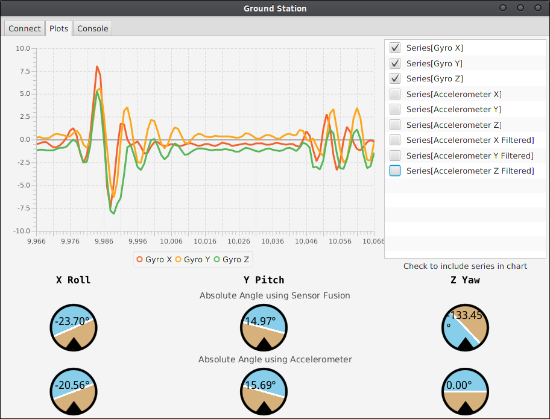

# GroundStation
Ground control software for testing, simulating and data analysis

## How to Run 

Simplest way is to open the project in Netbeans and run. 
For cli compiling ensure you include lib folder in `-classpath`.

##Dependacies

You need Java 8 (for lambda support).
UI is done in JavaFX 8u40

- For serial connection to Arduino we use **Java Simple Serial Connector** _2.8_ library  
- For special controls **ControlsFX** _8.40_

## Entry Point
The `GroundStation.java` is the main class and `start` is the main entry point. 
There is a main but it ultimately calls `start`